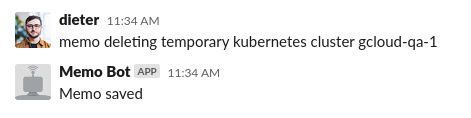
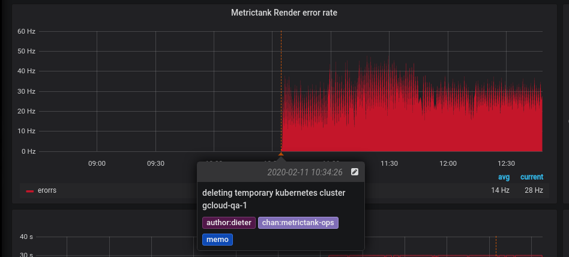
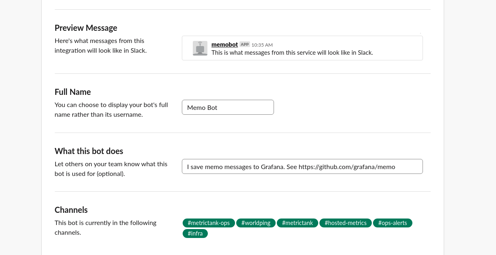
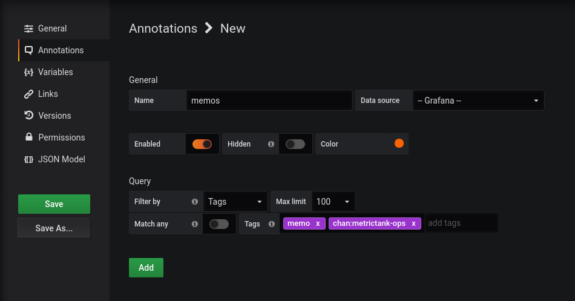

# Memo

inspired by https://github.com/Dieterbe/anthracite/ but now
as part of your chatops, chatdev, chatmarketing, chatWhatever workflow!

Comes with 2 programs:

* memo-cli: submit grafana annotations from the cli
* memod: slack bot, so you can can submit annotations from slack

## Huh?

Turn a slack message like this ...  
  
... into an annotation like this:  
  
Luckily somebody shared this memo on slack, otherwise somebody might freak out if they see this chart!

## memo-cli

```
Usage of ./memo-cli:
  -config string
    	config file location (default "~/.memo.toml")
  -msg string
    	message to submit
  -tags value
    	One or more comma-separated tags to submit, in addition to 'memo', 'user:<unix-username>' and 'host:<hostname>'
  -ts int
    	unix timestamp. always defaults to 'now' (default 1557953985)
```

Config file looks like:

```
[grafana]
api_key = "<grafana api key, editor role>"
api_url = "https://<grafana host>/api/"
```

## memod

Connects to slack and listens for "memo" messages which - if correctly formatted - will result in an annotation on the configured Grafana server

#### Message format

```
memo [timespec] <msg> [tags]
```

`[foo]` denotes that `foo` is optional.


#### timespec

defaults to `25`, so by default it assumes your message is about 25 seconds after the actual event happened.

It can have the following formats:

* `<duration>` like 0 (seconds), 10 (seconds), 30s, 1min20s, 2h, etc. see https://github.com/raintank/dur denotes how long ago the event took place
* `<RFC3339 spec>` like `2013-06-05T14:10:43Z`

#### msg

free-form text message, but if the first word looks like a timespec it will be interpreted as such.  Any words at the end with `:` in them will be interpreted as tags.

#### tags

default tags included:

* `memo`
* `chan:slack channel (if not a PM)`
* `author:slack username`

you can extend these. any words at the end of the command that have `:` will be used as key-value tags.
But you cannot override any of the default tags

# Installation of memod

## Configure slack

You set up the slack bot as a [bot integration](https://api.slack.com/bot-users).
Essentially in your slack workspace configuration, you create a bot with the name "memobot" and a token, and specify which channels to join by default.
Put the token in the memod config file (see below) and it should just work.
In the future we may look into creating a "real slack app".
Note that after the bot joins, you can still invite it into - or remove from - any other channel.



## Set up memod

Put a config file like below in `/etc/memo.toml`.

```
# one of trace debug info warn error fatal panic
log_level = "info"

[slack]
api_token = "<slack api token>"

[grafana]
api_key = "<grafana api key, editor role>"
api_url = "http://localhost/api/"
```

If you use upstart, you need to create an init file and put it in /etc/init/memo.conf
For your convenience you can use our [example upstart config file](./var/upstart-memo.conf)

## Set up the Grafana integration

You need to create a new annotation query on your applicable dashboards.
Make sure to set it to the Grafana datasource and use filtering by tag, you can use tags like `memo` and `chan:<chan-name>` or any other tags of your choosing.




